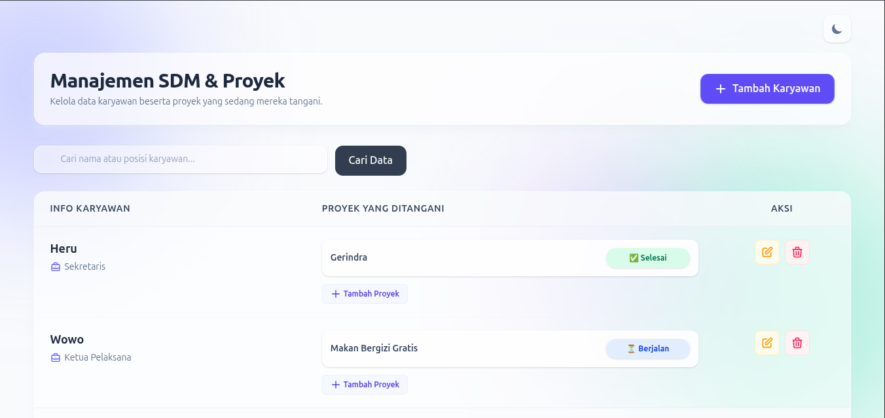
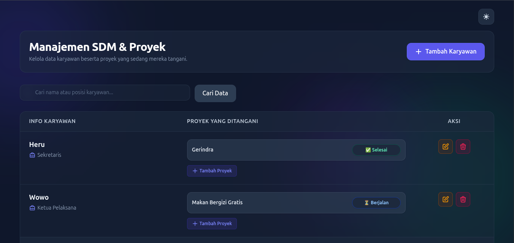
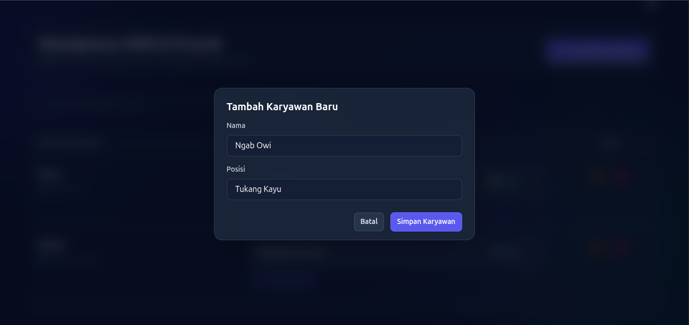
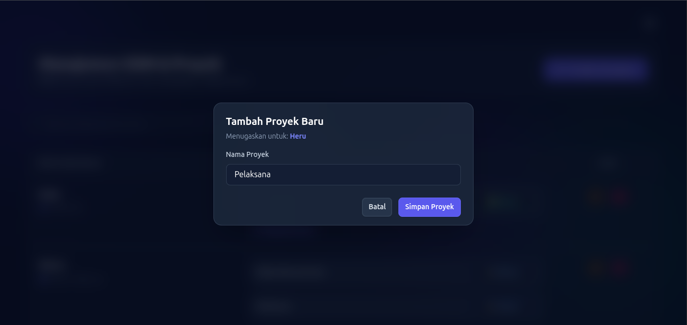

<p align="center"><a href="https://laravel.com" target="_blank"></a></p>

<p align="center">
<a href="https://github.com/laravel/framework/actions"></a>
<a href="https://packagist.org/packages/laravel/framework"></a>
<a href="https://packagist.org/packages/laravel/framework"></a>
<a href="https://packagist.org/packages/laravel/framework"></a>
</p>

# 🚀 NexHR - Modern Employee & Project Management System

Sebuah sistem informasi manajemen Sumber Daya Manusia (SDM) dan pemantauan Proyek berbasis web. Dibangun dengan fokus pada **Performa**, **Efisiensi**, dan **User Experience (UI/UX)** yang premium. 

Proyek ini mendemonstrasikan implementasi CRUD tingkat lanjut yang interaktif, meniru nuansa *Single Page Application* (SPA) menggunakan arsitektur Laravel yang solid.

<h1>Tampilan Dashboard Light Mode</h1>


<h1>Tampilan Dashboard Night Mode</h1>


<h1>Tambah Data Karyawan</h1>


<h1>Tambah Proyek Yang dikerjakan Karyawan</h1>


## 🚀 Cara Instalasi & Menjalankan Project

Jika Anda ingin menjalankan proyek ini di *local environment* Anda, ikuti langkah-langkah standar berikut:

1. **Clone repository ini:**
   ```bash
   git clone https://github.com/afwan-belang/belajar-orm.git 
   cd belajar-orm

2. **Instalasi Dependency Laravel:**
   ```bash
   composer install

3. **Instalasi Dependency NPM:**
   ```bash
   npm install

4. **Clone repository ini:**
    Duplikat file .env.example menjadi .env, lalu sesuaikan konfigurasi database Anda.
   ```bash
   cp .env.example .env
   php artisan key:generate

5. **Jalankan Migrasi Database:**
   ```bash
   php artisan migrate

6. **Jalankan 2 Server :**
    Buka dua terminal dan jalankan kedua perintah ini secara bersamaan:
   ```bash
   # Terminal 1 (Untuk menjalankan server PHP)
   php artisan serve

   # Terminal 2 (Untuk mengkompilasi asset Tailwind CSS & Vite)
   npm run dev

# Dibuat Oleh
Nama        : Muhammad Haikal Afwan
Kelas       : XI RPL 3
No. Absen   : 22
NIS         : 2425120693

SMKN 4 Bandung